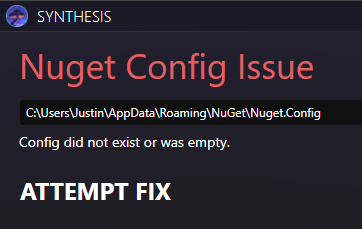

# Nuget Config Issues

## What Is Nuget?

Synthesis builds patchers source code right on your computer.  Nuget is the system that downloads all the libraries those patchers themselves need to run.

This should be installed and set up automatically when following the [installation instructions](../Installation.md), as part of the .NET SDK step.  No additional Nuget related steps are needed, usually.

## Missing or Empty Nuget.Config

The `Nuget.Config` is a file that tells your system where to go to download libraries from when they're needed.  By default, this config just lists nuget.org.

Sometimes this file is missing, or is empty.  It is unclear how this occurs to certain people, but it's fairly common.

### Detection

{ align=right }

Error typically manifests as this line in the logs:

```
error NU1100: Unable to resolve [Some Package]
```

The UI has some detection, and shows this screen.

### UI Fix
The UI itself can try to fix this issue with the `ATTEMPT FIX` button.  It will try to create the typical file for you.

### Adjust Manually

The `NuGet.Config` file is typically located in `%appdata%/nuget/NuGet.Config`

Here is a typical file:
```xml
<?xml version="1.0" encoding="utf-8"?>
<configuration>
  <packageSources>
    <add key="nuget.org" value="https://api.nuget.org/v3/index.json" protocolVersion="3" />
  </packageSources>
</configuration>
```

Where the line
```xml
<add key="nuget.org" value="https://api.nuget.org/v3/index.json" protocolVersion="3" />
```
tells it to go to nuget.org

You can make this file yourself if it is missing, or adjust it to your liking if it looks odd.

### Adjust with CLI Command

The DotNet SDK comes with some commands you can use in a command line

`dotnet nuget add source https://api.nuget.org/v3/index.json -n nuget.org`

Running this would add `nuget.org` to the file mentioned above.  You could check it afterwards to confirm.

## Corrupt Cache

When nuget downloads libraries, it puts them in a cache so it doesn't have to download them repeatedly.  Sometimes this can get corrupt.

### Detection

Error typically manifests as this line in the logs:

```
error NU1202: ___ does not support any target frameworks
```


# Other

This document only covers common issues.  Be sure to check the [discussions](https://github.com/Mutagen-Modding/Synthesis/discussions) area yourself if you're running into other more obscure issues.